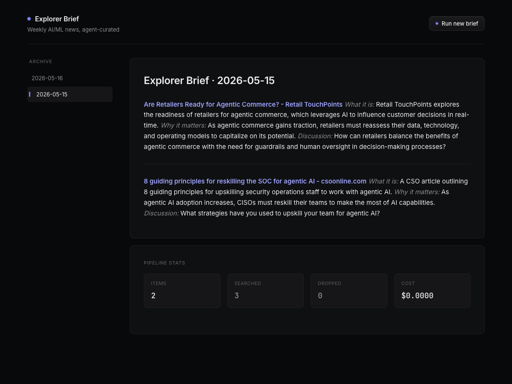
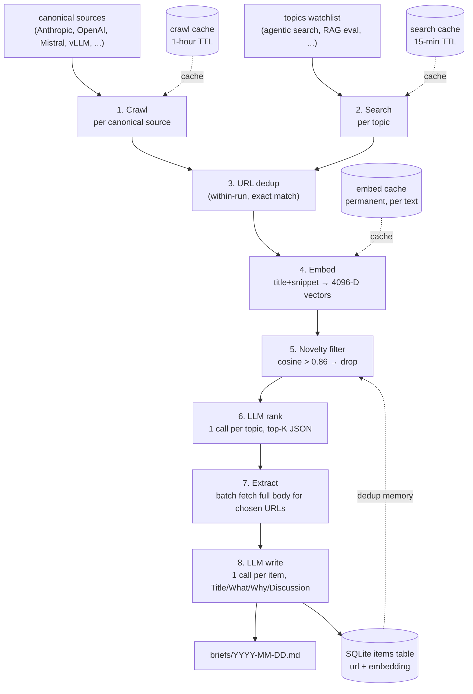
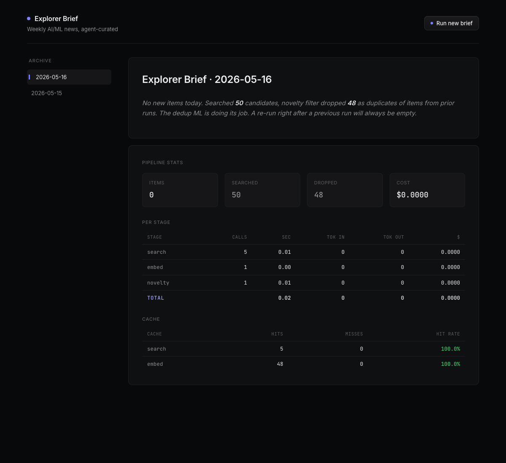

# AI News Scout

A small agent that scouts AI/ML news on a configurable watchlist, semantically dedupes results against everything it has ever read, ranks survivors with an LLM, and renders a Markdown brief you can paste anywhere.

<p align="center">
  
</p>

## What it does

One command runs an eight-stage pipeline against a list of topics ("agentic search", "RAG eval", ...) plus a set of canonical AI vendor blogs, picks the top items per topic in a `Title / What it is / Why it matters / Discussion` format, and saves both the rendered Markdown and a full per-stage performance profile to SQLite. A tiny FastAPI viewer reads it back as a single dark-themed page with sidebar, prose, and stats footer.

The interesting bit is the **novelty filter**: every candidate article is turned into a 4096-dimensional embedding and compared against a persistent memory of every article the agent has ever surfaced. Cosine similarity above `0.86` means "same story, different outlet" and the candidate is dropped. Run the pipeline twice in a row and the second run produces nothing, because the first run already absorbed everything novel.

## Architecture



| # | Stage | What | Cost |
|---|---|---|---|
| 1 | Crawl | One-hop crawl on canonical vendor blogs, with natural-language instructions | one crawl per source, 1-hour cache |
| 2 | Search | News search per topic, configurable recency window (default 1 week), query-expanded and noise-domain filtered | one search per topic, 15-min cache |
| 3 | URL dedup | Exact-match collapse across crawl + search | free |
| 4 | Embed | Qwen3-Embedding-8B on title+snippet | one batched embed call |
| 5 | Novelty filter | Cosine vs prior corpus, drop if > 0.86 | numpy matmul, microseconds |
| 6 | Rank | One LLM call per topic, returns top-K JSON with reasons | one chat call per topic |
| 7 | Extract | Batch fetch full Markdown body for the top picks | one batched extract call, up to 20 URLs |
| 8 | Write | One LLM call per chosen item, produces the entry | one chat call per chosen item |

Survivors land in an `items` table keyed on URL. A second across-run safety net rides on top of the novelty filter: `save_items` uses `INSERT OR IGNORE`, so a same-URL twin that somehow slipped past cosine still gets dropped at the storage boundary. Defense in depth, free.

## Performance

Numbers below are from one cold `make brief-debug` run (1 topic, top-k=2, with the crawl stage on against 5 canonical vendor sources). Crawl produced 34 of the 37 candidates, search produced the other 3. Empty corpus on the first run means novelty dropped nothing and 6 topic groups went to RANK, yielding 10 picks for the writer.

| Stage | Calls | Time | Tokens in | Tokens out | Tavily credits | $ |
|---|---|---|---|---|---|---|
| crawl | 5 | 28.1s | 0 | 0 | 13.6 | 0.1088 |
| search | 1 | 5.3s | 0 | 0 | 2.0 | 0.0160 |
| embed | 1 | 2.3s | 12,691 | 0 | 0.0 | 0.0003 |
| novelty | 1 | <0.01s | 0 | 0 | 0.0 | 0.0000 |
| rank | 6 | 33.9s | 6,073 | 590 | 0.0 | 0.0002 |
| extract | 1 | 0.9s | 0 | 0 | 2.0 | 0.0160 |
| write | 10 | 40.4s | 10,861 | 1,287 | 0.0 | 0.0003 |
| **total** | | **~111s** | **~30k** | **~1.9k** | **17.6** | **~$0.14** |

Crawl dominates both time and cost. Set `ENABLE_CRAWL=false` (or pass `--no-crawl`) to skip it while iterating locally on the rest of the pipeline.

Cache hits on a re-run within 15 minutes drop search and crawl to zero (TTL caches) and embed to zero (permanent text-to-vector cache). The stats footer surfaces this in real time:

<p align="center">
  
</p>

A back-to-back re-run on the same data finished in milliseconds with **zero LLM calls and $0 spent**: every candidate matched a prior embedding, so novelty dropped all of them and RANK / EXTRACT / WRITE never opened. That is the dedup ML doing its job, visible as a stat rather than a guess.

## Run locally

```bash
uv sync                  # install deps (needs uv + Python 3.13)
cp .env.example .env     # then fill in TAVILY_API_KEY and NEBIUS_API_KEY
make smoke               # 1 search + 1 chat + 1 embed call, ~$0.0002, verifies keys
make brief-small         # tiny end-to-end run, ~$0.0005
make api                 # viewer on http://127.0.0.1:8000
```

`make help` lists every target. A full run (`make brief`, 5 topics x 10 results) costs roughly $0.15.

