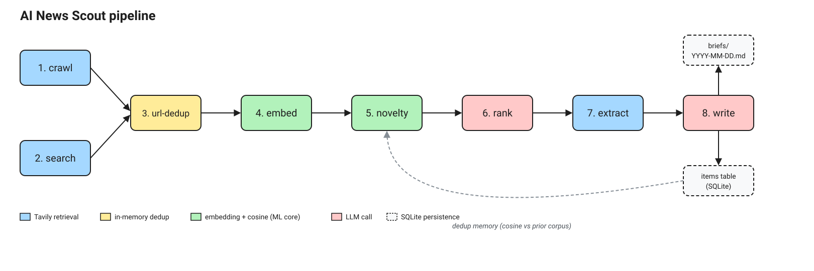

# AI News Scout. Design Document

A walkthrough of the architecture, the design decisions behind it, and how the
pieces fit together. For "how do I run it" see the [README](../README.md).

---

## 1. Overview

AI News Scout is an eight-stage compound AI system that turns a watchlist of
AI/ML topics plus a set of canonical vendor blogs into a curated Markdown brief.
It combines two third-party APIs (Tavily for retrieval, Nebius Token Factory
for inference) and a local SQLite database. There is no orchestration
framework, no vector DB, no message queue. The whole engine fits in
`src/ai_news_scout/` and runs end-to-end in roughly 100 seconds for about $0.15
on a full cold run, dropping to milliseconds and zero dollars on a cache-warm
re-run.

The system is best described as a **linear DAG with one fan-in node**
(`url-dedup`), not an agent. The LLM never decides which step runs next, the
control flow is hard-coded in `pipeline.run()`. This is a deliberate design
choice, see [design decision #1](#1-linear-dag-not-an-agent).

---

## 2. High-level architecture

The pipeline has two retrieval entry points (crawl, search) that fan in at
URL dedup and then proceed linearly through embedding, novelty, rank, extract,
and write:

<p align="center">
  
</p>


The editable source is [`pipeline.excalidraw`](pipeline.excalidraw). Open it in
any editor with an Excalidraw extension (the Antigravity extension and the VS
Code Excalidraw extension both work). After editing, re-export to
`pipeline.svg` via the extension's "Export to SVG" action so the embedded
version stays in sync.

### What flows between stages

| From | To | Payload |
|---|---|---|
| crawl | url-dedup | `list[SearchResult]` with `source="crawl"` and `topic=<root_url>` |
| search | url-dedup | `list[SearchResult]` with `source="search"` and `topic=<watchlist label>` |
| url-dedup | embed | deduped `list[SearchResult]` (highest-score wins per URL) |
| embed | novelty | `np.ndarray` of shape `(n, 4096)` plus the original items |
| novelty | rank | survivor items grouped by topic, prior-corpus duplicates dropped |
| rank | extract | flat list of `(SearchResult, reason)` chosen by the LLM |
| extract | write | dict mapping URL to extracted Markdown body |
| write | brief | one `entry` dict per chosen item, then rendered to Markdown |

### Three side channels

1. **`items` table** is read by `novelty` (prior corpus) and written by `run()`
   at the end (new survivors). This is what makes the pipeline a recurring
   agent rather than a one-shot script. The dedup memory persists across runs.
2. **`cache` table** is read and written by every Tavily and embedding call.
   Search has a 15-minute TTL, crawl has a 1-hour TTL, embeddings have no TTL
   (the cache key includes the model name so a model swap is naturally safe).
3. **`Profiler`** is threaded through every stage to record latency, token
   usage, Tavily credits, cache hits, and dollar cost. Its output is the per-run
   stats table in the CLI (`--profile`) and the persistent footer in the web
   viewer.

---

## 3. Pipeline stages in detail

### Stage 1. Crawl

For each canonical source in `Settings.canonical_sources` (Anthropic, OpenAI,
Mistral, vLLM, Nebius blogs by default), call Tavily's `/crawl` endpoint with
a one-hop depth and natural-language instructions ("Recent posts about model
releases"). Returns up to 10 pages per source, tagged with `source="crawl"`
and `topic=<root_url>`. Cached for one hour because vendor blogs change in
hours, not minutes.

Runs first because it has the longest timeout (90s) and is the most
failure-prone Tavily endpoint. A hang here gets surfaced before any LLM
spend happens downstream.

Optional. Set `ENABLE_CRAWL=false` or pass `--no-crawl` to skip. This is the
single biggest cost lever in the pipeline.

### Stage 2. Search

For each topic in the watchlist, run `Tavily /search` with `search_depth=advanced`,
`topic=news`, a configurable `time_range` (default `week`), and a list of
noise domains to exclude (`medium.com`, `dev.to`, `substack.com` by default).
The query string itself comes from `Settings.topic_queries`, which expands a
bare watchlist label like `"RAG eval"` into a richer query like
`"retrieval augmented generation evaluation benchmarks RAGAS"`. Cached for 15
minutes.

Results are tagged with `source="search"` and `topic=<watchlist label>`.

### Stage 3. URL dedup

Pure in-memory step. Collapses same-URL entries across the union of crawl +
search results, keeping the highest-score copy. Preserves first-seen insertion
order so downstream stages get a stable iteration order across runs.

This is the within-run safety net. The across-run safety net is the
`url TEXT PRIMARY KEY` on the `items` table and `INSERT OR IGNORE` in
`save_items`, which catches anything cosine-novelty lets through.

### Stage 4. Embed

For every survivor, build a single embedding text of the form
`"<title>\n\n<body>[:1500]"` and send through the Nebius embedding model
(default `Qwen/Qwen3-Embedding-8B`, 4096 dimensions). The embed cache key is
`sha256(model || text)` and has no expiry, so the same text always returns
the same vector and a model swap never silently returns the wrong-dim vector.
Only cache-miss texts hit the API, and misses are batched into a single request
(capped defensively at 100 inputs per call).

### Stage 5. Novelty filter

This is the ML core of the agent. Load every prior embedding from the `items`
table, normalize, and compute `max(cosine(candidate, prior))` for each
candidate. If the maximum exceeds `dedup_threshold` (default `0.86`), drop.

A first run sees an empty corpus and drops nothing. A re-run within seconds
finds every candidate already in the corpus and drops everything. That is
visible in the stats footer as `n_dropped_novelty = n_after_url_dedup` and is
the most concrete signal that the dedup ML is doing real work.

Embedding-dim mismatches (model swap mid-history) are filtered out with a
warning rather than crashing, see `Store.all_embeddings()`.

### Stage 6. Rank

For each topic, send one strict-schema chat call to Nebius via
`Nebius.chat_parsed(...)`. The response is parsed into a `RankResponse`
Pydantic model with a list of `RankPick(url, reason)`. URLs are validated
against the input set, so any URL the model hallucinates is silently dropped.

Topics fan out across a `ThreadPoolExecutor` (default 5 workers) so a 5-topic
watchlist completes in roughly the time of one call, not five.

System+user message split: `RANK_SYSTEM` holds the editor persona and
selection criteria, `RANK_USER` holds the topic and JSON-serialized candidate
list. This shape is the format Llama-3 instruction-tuning expects.

### Stage 7. Extract

Single batched `Tavily /extract` call on the chosen URLs (capped at 20 per
call, chunked internally). Returns clean Markdown bodies, dropping any URL
Tavily failed on. The extracted body is what `write` grounds its claims on,
the original search snippet is rarely enough.

### Stage 8. Write

For each chosen item, send one chat call to Nebius with a system prompt that
enforces the four-line AI News Scout entry format and a user prompt with the title, URL,
and extracted body. The model fills in `**[TITLE](URL)**` followed by
`*What it is:* / *Why it matters:* / *Discussion:*`.

The system prompt includes a worked example and explicit contrastive negative
examples (`**TITLE** (URL)` is wrong, `**TITLE**` with no URL is wrong)
because the smaller models occasionally regress on the Markdown-link form
without them.

Write also fans out across the same `ThreadPoolExecutor`.

After write, all survivors (not just chosen ones) get inserted into `items`
with `INSERT OR IGNORE`. This is intentional. Even rejected candidates count
as "already seen" so future runs do not re-rank the same noise.

---

## 4. Components

```
src/ai_news_scout/
  config.py     # Settings(BaseSettings). env + .env loading
  providers.py  # Tavily, Nebius. SDK wrappers with timeouts and retries
  store.py      # SQLite. items + embeddings, briefs, cache
  prompts.py    # RANK_SYSTEM/USER, WRITE_SYSTEM/USER. Versioned
  profiler.py   # Profiler + StageStats + CacheStats. Thread-safe
  pipeline.py   # The 8-stage run() with cached crawl, search, embeddings
  brief.py      # entries dict to Markdown renderer
  cli.py        # `brief` entry point. Composition root
  api.py        # FastAPI viewer. Composition root
  _smoke.py     # provider sanity check, ~$0.0003
```

### config.py

`Settings(BaseSettings)` loads from env and `.env` via pydantic-settings. Holds
API keys, model names, the default watchlist, topic to query expansion,
canonical sources, exclude domains, recency window, and the crawl on/off
master switch.

A `model_validator` defaults `rank_model` and `write_model` to
`nebius_llm_model` if unset, so per-stage model routing is opt-in.

### providers.py

Two clients, both take explicit values in `__init__` (no env reads in the
client).

`Tavily` wraps the official SDK with:
- A `_tavily_with_retry` helper that retries `UsageLimitExceededError` and
  `TimeoutError` with exponential backoff (1s, 2s, 4s).
- Per-call timeouts: 30s search, 60s extract, 90s crawl.
- An `extract()` method that chunks inputs at 20 URLs per call (Tavily's
  per-request cap).

`Nebius` wraps the OpenAI SDK pointed at `api.tokenfactory.nebius.com/v1`
with:
- An explicit `httpx.Timeout(60.0, read=45.0, write=10.0, connect=5.0)`
  instead of the SDK default of 10 minutes total.
- `max_retries=3` (default is 2).
- A `chat()` method for free-form completions.
- A `chat_parsed(messages, response_model)` method that uses the SDK's
  `chat.completions.parse()` to enforce a Pydantic schema as strict JSON
  schema. Returns a parsed Pydantic instance or `None` on refusal.
- An `embed()` method that chunks at 100 inputs per call and aggregates usage.

Pricing constants for both providers live here, used by the profiler to
estimate per-stage dollar cost.

### store.py

Thin wrapper over SQLite. Three tables (see [decision #2](#2-sqlite-as-the-entire-data-layer)).

PRAGMAs set on connect:
- `journal_mode=WAL` allows reads to run concurrently with one writer.
- `synchronous=NORMAL` trims fsync cost.
- `busy_timeout=5000` retries instead of raising `SQLITE_BUSY`.
- `check_same_thread=False` lets FastAPI's threadpool workers reuse one
  `Store` instance.

`all_embeddings()` returns the prior corpus as one `(n, dim)` matrix.
Mismatched dims (from a mid-history model swap) are filtered with a warning.

### prompts.py

Exports `VERSION` plus four prompt strings: `RANK_SYSTEM`, `RANK_USER`,
`WRITE_SYSTEM`, `WRITE_USER`. The version constant is bumped any time the
prompts change so historical briefs can be correlated with the prompt revision
that produced them.

A `_STYLE_RULE` constant is shared between the two system prompts and forbids
em-dashes and semicolons in generated text.

### profiler.py

A context manager plus three add methods. Tracks per-stage seconds, API call
count, prompt and completion tokens, Tavily credits, and dollar cost. Cache
hits and misses live in a separate ledger keyed by cache name (search, crawl,
embed).

Thread-safe. A `threading.Lock` guards every mutation so the concurrent rank
and write fan-outs can safely call `add_usage` on the same `Profiler` from
multiple threads.

The `calls` counter is incremented by `add_usage` and `add_tavily_credits`,
not by the stage context manager. This means `write: calls=10` reflects 10
actual LLM calls, not "the write stage was opened once."

### pipeline.py

The orchestrator. Top-level `run(...)` takes providers, settings-ish
arguments, and the topics list as parameters and returns a dict with the
date, markdown, entries, JSON-safe stats, and the live Profiler.

Defines two private Pydantic models (`RankPick`, `RankResponse`) for the
rank-stage structured output. Holds the cached versions of search, crawl, and
embed.

`run()` is the only public function. There is no `Pipeline` class because
there is no state worth holding across runs that does not already live in
`Store`.

### brief.py

Renders the final `entries` list to the Markdown brief. Handles the three
empty-brief cases (no search results, no ranker picks, novelty dropped
everything) with bespoke text so users see why the brief is empty.

### cli.py and api.py

The two **composition roots** (see [decision #3](#3-composition-root-for-testability)).
Both read `Settings()`, construct `Tavily`, `Nebius`, and `Store`, and hand
them to `pipeline.run()` as keyword arguments. The pipeline never reaches for
its own dependencies, which is what makes provider-stub injection in tests
zero-cost.

`api.py` constructs resources once in FastAPI's `lifespan` context manager
and stashes them on `app.state`. Routes pull them via `Depends(get_store)`
etc., which lets tests override individual providers with
`app.dependency_overrides`.

### _smoke.py

One Tavily search, one Nebius chat, one Nebius `chat_parsed`, one Nebius
embed. About $0.0003. Run before a full `make brief` to confirm both API keys
work and that the structured-output path is supported by the currently
configured model.

---

## 5. Key design decisions

### 1. Linear DAG, not an agent

The pipeline has zero LLM-driven control flow. Every step's existence,
order, and inputs are decided by `pipeline.run()`, not by a planner.
LangChain and LangGraph are unnecessary here because there is no graph to
configure, no agent to route, and no tool-use loop.

The LLM is asked to do exactly two things: rank a fixed list of candidates,
and write a fixed-format entry for one item. Both calls have strict input and
output shapes. This is the right abstraction level for a curated weekly brief
where reproducibility and cost predictability matter more than flexibility.

If the requirements grow (multi-step verification, follow-up searches per
chosen item, tool use), then a graph framework becomes the right answer. Not
before.

### 2. SQLite as the entire data layer

Three tables, one file, zero ops:

| Table | Primary key | Purpose | Write semantics |
|---|---|---|---|
| `items` | `url` | dedup memory plus embedding store | `INSERT OR IGNORE` (accumulate) |
| `briefs` | `date` | one row per brief with full Markdown + stats JSON | `INSERT OR REPLACE` (overwrite) |
| `cache` | `key` | Tavily and embedding response cache | `INSERT OR REPLACE` with optional `expires_at` |

Embeddings live in `items` as float32 BLOBs, loaded all-at-once into a numpy
matrix for the novelty step. At well under 10k items, cosine over the full
matrix is microseconds. Reaching for a vector DB at this scale would be a
YAGNI mistake, the storage and the math both fit comfortably in process.

The `url TEXT PRIMARY KEY` on `items` plus `INSERT OR IGNORE` is the
across-run safety net for the novelty filter. A same-URL twin that slips
past cosine still gets dropped at the storage boundary. Defense in depth,
free.

The `cache` table holds two very different things (search responses with a
short TTL, embedding vectors with no expiry). Same row schema works for both
because the `value` column is BLOB and the cache key is salted with the model
name so embedding cache entries are naturally scoped.

### 3. Composition root for testability

`pipeline.run()` takes `tavily` and `nebius` as required keyword arguments.
The pipeline never instantiates a `Tavily()` or `Nebius()` itself. CLI and
API are the only places where the real clients get constructed.

This makes the entire pipeline trivially stub-injectable. `tests/conftest.py`
defines `FakeTavily` and `FakeNebius` that record every call and return canned
results. Tests get full coverage of the eight-stage flow without ever hitting
the network, without monkey-patching, and without mocking framework magic.

CLI and API share the entire engine with zero duplication. Every call site
constructs the same three resources (`Settings`, `Tavily`, `Nebius`) and hands
them to the same `run()`.

### 4. Versioned prompts

`prompts.py` exports `VERSION = "v4"` alongside the four prompt strings. The
version is bumped whenever output style changes so historical briefs in the
`briefs` table can be correlated with the prompt revision that produced them.

This is the cheapest possible form of prompt versioning. Anything more
elaborate (one file per prompt-version, prompt registry) would be premature
at this scale.

### 5. Per-text embedding cache, batched API call

The embed step has the highest hit rate in the cache layer because the same
title and snippet often shows up across multiple watchlist topics. Only
cache-miss texts hit the API, and misses are batched into a single request.

The cache key is `sha256("embed:" || model_name || "\x00" || text)`. The
model name is part of the key so swapping `Qwen3-Embedding-8B` for a
different embed model never returns a stale vector. Old vectors stay in cache
but are simply never selected.

### 6. Per-stage profiler with thread-safe accumulation

A `Profiler` context manager wraps each stage and tracks wall-clock time,
call count, token usage, Tavily credits, and dollar cost. Cache hits and
misses live on a separate per-cache ledger.

Cost and latency become first-class observable signals from day one rather
than a thing you bolt on after the fact. The `--profile` flag renders the
per-stage table in the CLI, and the same data is the persistent footer in
the web viewer.

The profiler is thread-safe via a single `threading.Lock` that guards stage
opens, usage adds, credit adds, and cache events. This is necessary because
rank and write fan out across a `ThreadPoolExecutor` and call `add_usage`
from multiple worker threads concurrently.

### 7. Pydantic + chat.completions.parse() for structured outputs

The rank stage's response shape is a Pydantic model (`RankResponse`) that
holds a list of `RankPick(url, reason)`. The OpenAI SDK's
`chat.completions.parse()` auto-converts the model into a strict JSON schema
(`additionalProperties=false`, all fields required) and sends it as
`response_format`. The Nebius server sees the same `{"type": "json_schema",
...}` shape its docs document.

Two wins over the old `response_format={"type": "json_object"}` path:
1. The Pydantic model is the **single source of truth** for the shape.
   The prompt asks for `{"picks": [...]}` and the SDK enforces it.
2. No `json.loads()` plus manual validation plus error handling in the
   pipeline. The SDK returns a parsed Pydantic instance or `None` on refusal.

### 8. ThreadPoolExecutor for fan-out stages

Both rank (one call per topic) and write (one call per chosen item) fan out
across a `ThreadPoolExecutor` with a bounded worker pool (default 5). On a
5-topic, 10-item run, this brings the write stage from ~40s sequential to
roughly 10s wall-clock at the cost of more peak concurrency on the Nebius
side.

The bound exists to stay polite under any provider-side per-minute quotas.

### 9. Two-layer dedup defense

The dedup story has two layers:

1. **Cosine novelty filter** at stage 5 (the ML core). Catches "same story,
   different outlet" plus exact URL duplicates that survived stage 3.
2. **`INSERT OR IGNORE` on `items.url`** at the storage boundary. Catches
   anything that somehow slipped past cosine (model swap mid-run, two URLs
   colliding to vectors below threshold, ...).

The redundancy is free (the storage check is a constant-time index lookup)
and converts the strongest failure mode of a pure-embedding dedup ("the
threshold is wrong for this story") into a survivable one. The brief might
include a near-duplicate the first time, but the second run will not.

### 10. Cache TTLs aligned with update rates

| Cache | TTL | Why |
|---|---|---|
| search | 15 min | News changes faster than blogs. Re-running within a quarter-hour gives the same answer. |
| crawl | 1 hour | Vendor blog indexes change in hours, not minutes. Crawl is the most expensive Tavily call. |
| embed | none | A `(model, text)` pair is deterministic. The result never goes stale. |

Aggressive embed caching is what makes the same-data re-run cost zero. Every
text gets one shot at the API and then lives in SQLite forever.

---

## 6. Reliability and observability

- **Tavily retries** with exponential backoff (1s, 2s, 4s) on
  `UsageLimitExceededError` and `TimeoutError`. All other errors propagate
  immediately so we do not burn money on permanent failures.
- **Nebius HTTP client** uses an explicit `httpx.Timeout(60, read=45,
  write=10, connect=5)` and `max_retries=3`. The OpenAI SDK default is 10
  minutes total, far too forgiving for a background pipeline.
- **WAL mode on SQLite** plus `busy_timeout=5000` lets the FastAPI viewer
  read briefs concurrently with a `POST /run` write.
- **Per-stage profiler** with cost/latency/cache-hit-rate visible in the CLI
  table and the viewer footer.
- **Empty-brief explanations**: the renderer surfaces "novelty dropped N as
  duplicates" or "ranker selected none" so a quiet day reads differently
  from a broken pipeline.
